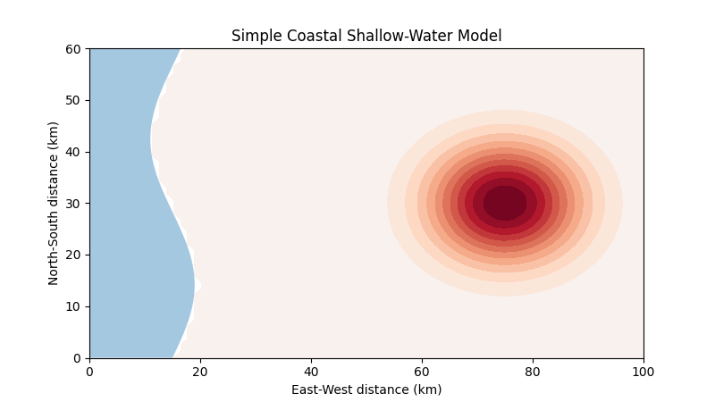

# Simple Coastal Shallow-Water Model

A small educational Python model showing the basic numerical ideas behind coastal hydrodynamic models such as **ROMS, SCHISM and Delft3D FM**.

**Important:** this is a teaching model, not a validated operational ocean model.

## Model Animation

The animation below shows the simulated evolution of sea-surface height and depth-averaged currents.




## What the model simulates

The model has an idealised coastline and bathymetry, sea-surface height (`eta`), and depth-averaged currents (`u`, `v`).

An initial sea-level disturbance creates a pressure gradient. That pressure gradient accelerates the water. The resulting water transport changes sea level, so the system evolves through time.

## Basic concept flowchart

```text
        Bathymetry H
             |
             v
 Initial sea-level anomaly eta
             |
             v
   Sea-surface slope grad(eta)
             |
             v
    Pressure-gradient force
             |
             v
       Currents u, v
             |
             v
   Water transport Hu, Hv
             |
             v
Convergence / divergence
             |
             v
      New sea level eta
             |
             +-----------> repeat through time
```

The shortest way to remember it is:

```text
sea level
   ↓
surface slope
   ↓
pressure gradient
   ↓
current
   ↓
water transport
   ↓
sea-level change
   ↺
```

## Equations

The model uses a simplified depth-averaged shallow-water system.

Continuity:

```text
d(eta)/dt + d(Hu)/dx + d(Hv)/dy = 0
```

Momentum:

```text
du/dt = -g d(eta)/dx
dv/dt = -g d(eta)/dy
```

A small friction term is also applied.

## How this relates to ROMS and other coastal models

| Toy model | Real model |
|---|---|
| 2-D depth averaged | ROMS is normally 3-D |
| Idealised bathymetry | Real bathymetric/topographic datasets |
| Sea level + u/v | Temperature, salinity, turbulence, etc. |
| Simple friction | Detailed bottom/vertical mixing |
| Simple boundary damping | Tides and open-boundary conditions |
| No Coriolis | Earth rotation included |
| No wind | Atmospheric forcing |
| No waves | Coupling with SWAN/WW3 possible |
| No sediment | Sediment/morphology modules possible |
| No particles | Currents can drive OpenDrift |

## Coastal modelling family

```text
Wind / atmospheric forcing          Tide / open boundary
            \                         /
             \                       /
              v                     v
            ROMS / SCHISM / Delft3D
               HYDRODYNAMICS
                     |
          +----------+----------+
          |                     |
          v                     v
   Current + sea level      Current field
          |                     |
          v                     v
      SWAN / WW3             OpenDrift
        WAVES                PARTICLES
          |
          v
 Sediment transport
          |
          v
 Morphology / coastline change
```

A useful mental model is:

- **ROMS / SCHISM / Delft3D** → how the water moves
- **SWAN / WW3** → how waves propagate
- **Sediment model** → how sand/sediment moves
- **OpenDrift** → where particles or floating objects go

## Files

```text
coastal_github_repo/
├── coastal_model.py
├── README.md
├── requirements.txt
├── run.sh
└── .gitignore
```

## Install

```bash
pip install -r requirements.txt
```

## Run

```bash
python coastal_model.py
```

or:

```bash
bash run.sh
```

The program creates:

```text
figures/coastal_model.gif
```

This is convenient on HPC systems such as NCI/Gadi because an interactive graphical display is not required.

## What you see in the animation

- red/blue shading: sea-surface-height anomaly
- black arrows: depth-averaged current
- tan region: land
- curved land boundary: idealised coastline

## Next development steps

A useful progression toward a more realistic mini coastal model is:

1. Add sinusoidal tidal forcing.
2. Add Coriolis force.
3. Add wind stress.
4. Add realistic bathymetry.
5. Add passive particles.
6. Add wave forcing.
7. Add simple sediment transport.
8. Read/write NetCDF data.

These extensions help connect this educational code to the workflows used in ROMS, SCHISM, Delft3D, SWAN and OpenDrift.
